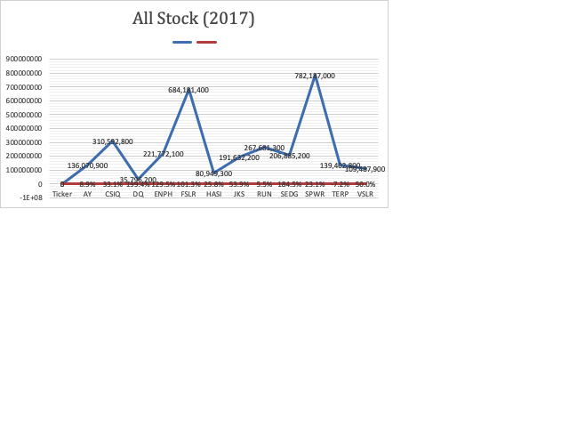
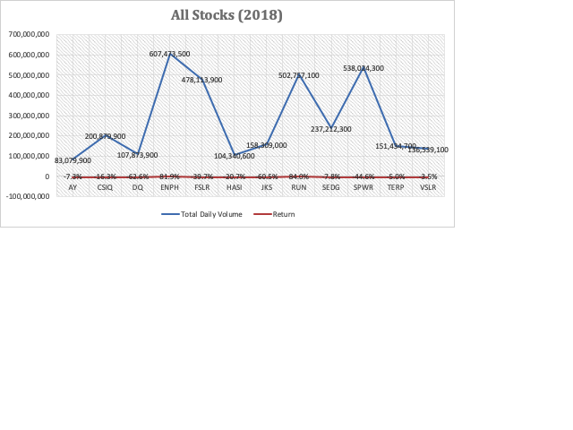

# Stock-Analysis

Performing analysis on the stock market data using VBA 

## Description of the project

Steve is a recent graduate with a finance background. His parents are his first client, they are passionate about green energy. They believe as fossile fules get used up, there will be more reliance on alternative energy production. Steve's parents without doing much research want to invest all their money in a company call DAQO new energy corporation that makes wafer for solar panels.

Steve promised his parents to look into DAQO'S stock for his parents, but he is concerned about diversifying their funds. He wants to analyze a hand full of green energy stocks in addition to DAQO'S stocks. Steve created an excel file consisting the stock data that needs to be analyzed to help him.

To complete this task an extension to excel build to automate tasks - VBA is used. Using code to automate analysis will allow Steve to use it on any stock which decreases the chance of accidents and errors, also reduces the time needed to run analysis especially if they need to be done repeatedly.

## Results 

After performing detailed analysis of the Stock data for the year 2017 and 2018, we can see DQ did really well in 2017 with a yearly return of 199.4%. All the other green energy stocks did well in 2017 other than TERP, which has a yearly return of -7.2%.The following line chart shows these results.  

   

 

The year of 2018 was worse for the green energry stocks, most of the stocks in 2018 had a very low yearly return. DQ has a yearly return of -62.6%. Only ENPH and RUN did well with a yearly return of 81.9% and 84.0% respectively.  

  

## Summary 

Steve will have to explain the results to his parents and let them know that DQO had a very low yearly return in 2018 where as the yearly return for DQO was quite impressing in 2017. 

Recent data is missing because of which it is hard to tell if patterns in the data are still the same in todays time or not. Steve will need to run the same analysis on more stocks data to know where should his parents be investing so that they have higher chances of making money. 
